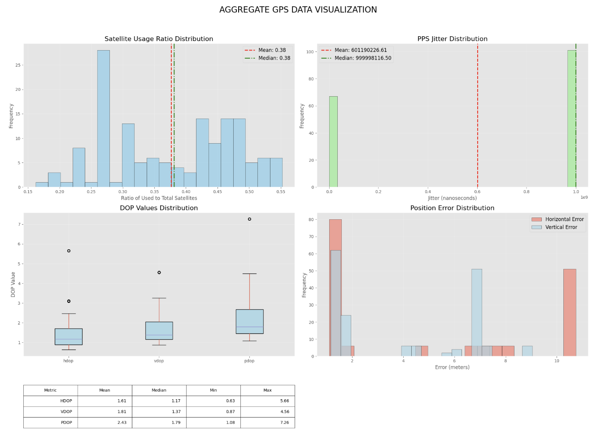
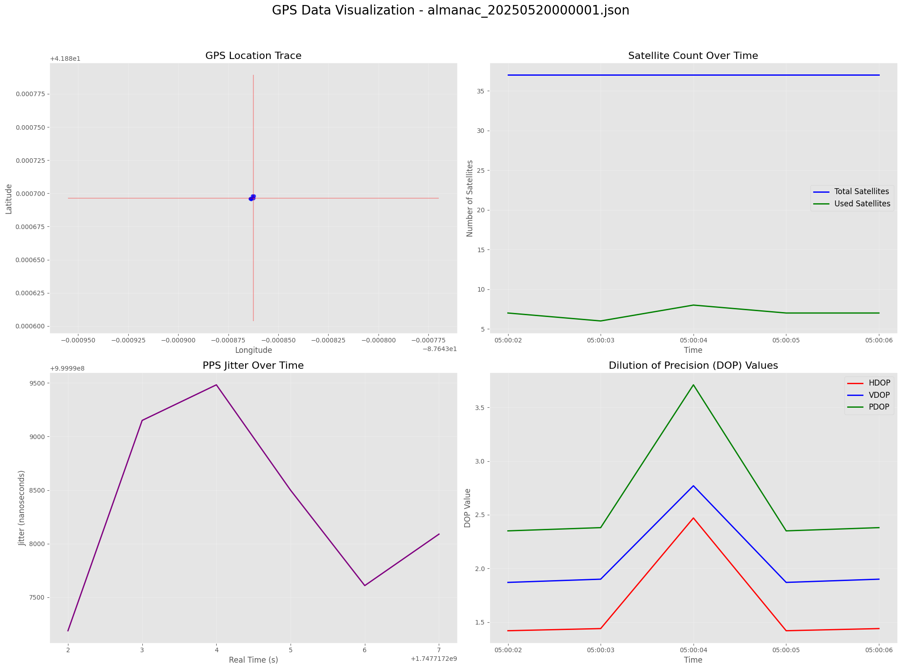
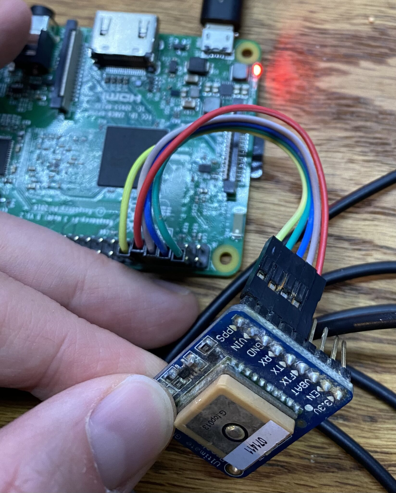
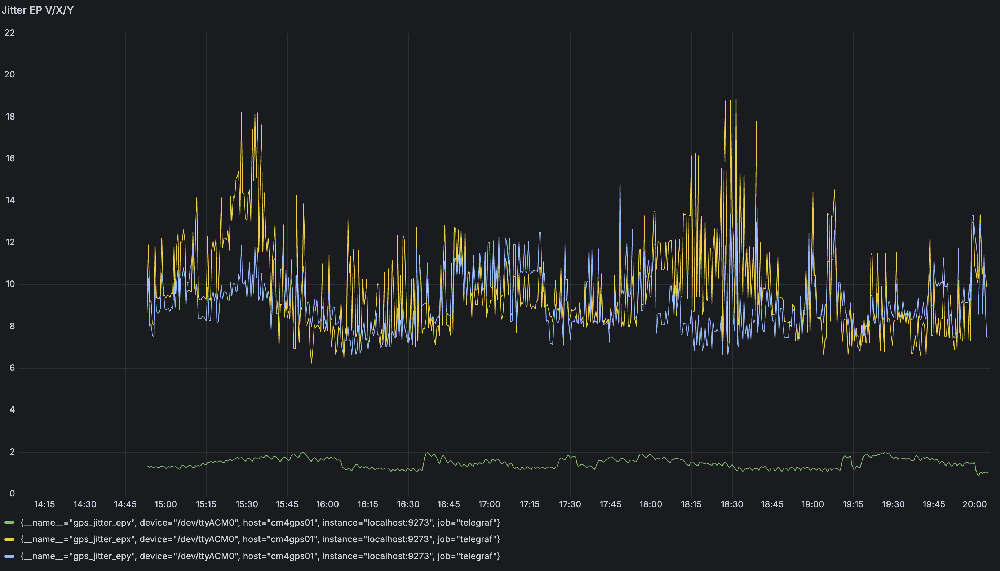

# FINAL REPORT

**Executive Summary:**
This project aims to build a low-cost, precision time server using a Raspberry Pi CM4, GNSS receiver, and pulse-per-second (PPS) signal integration. The goal is to achieve sub-microsecond synchronization accuracy for time-sensitive applications, such as high-frequency trading (HFT) and distributed systems. By leveraging GPSD, chrony, and Telegraf for metric reporting, and visualizing with Grafana, the system provides live monitoring of satellite lock, jitter, and PTP clock quality.
Key outcomes include successful PPS signal parsing, live GPS/CPU metric exports, and Prometheus-compatible dashboard panels. The final recommendation is that this architecture is suitable for educational and experimental precision timing, though long-term deployment may benefit from hardware timestamping or grandmaster PTP hardware.

[[_TOC_]]

## 1. Introduction
In the world’s most competitive financial markets, *every millisecond is a race*. Traders and algorithms compete in what is known as the “race to zero”—the relentless quest to reduce trading latency to as close to zero as technology allows. In high-frequency trading (HFT), where thousands of orders are executed in the blink of an eye, victory belongs to those who can act fastest and most precisely. Here, time is not just money—it is the very fabric of fairness, opportunity, and success. Yet, in this environment, speed alone is not enough; it is the precision of time synchronization that determines who truly wins the race.

The “race to zero” has made accurate clock synchronization the backbone of modern electronic trading. Every microsecond matters: even the smallest misalignment between system clocks can result in trades being executed out of order, causing financial losses and regulatory complications. As exchanges prioritize orders by both price and the exact time of arrival, precise timekeeping ensures the integrity and transparency of the market.

Precise time synchronization is critical in fields like financial trading, telecommunications, and distributed computing. Commercial Precision Time Protocol (PTP) servers can be costly and complex. This project explores building a compact, affordable alternative using a Raspberry Pi Compute Module 4 (CM4) paired with a u-blox ZED-F9T Global Navigation Satellite System (GNSS) module. The objective is to design, configure, and verify a system capable of delivering precise Coordinated Universal Time (UTC)-synchronized timing signals and monitoring system jitter, satellite visibility, and clock quality. The work is scoped to Linux-based Pulse Per Second (PPS) processing and metric collection, without reliance on hardware timestamping network interface cards (NICs) or field-programmable gate array (FPGA) devices.

The need for such solutions is driven by both technological and regulatory pressures. Regulatory bodies such as the European Union’s Markets in Financial Instruments Directive II (MiFID II), the United States Financial Industry Regulatory Authority (FINRA), and the Securities and Exchange Commission (SEC) mandate strict synchronization requirements—often within microseconds of official standards like Coordinated Universal Time (UTC) or the National Institute of Standards and Technology (NIST). Achieving this level of accuracy requires robust protocols such as Network Time Protocol (NTP) and Precision Time Protocol (PTP), as well as fault-tolerant architectures that use multiple independent and traceable time sources, including Global Positioning System (GPS).

Traditional enterprise-grade time servers can be prohibitively expensive, especially for smaller firms or research and educational environments. Recent advances have demonstrated that affordable, single-board computers like the Raspberry Pi can serve as the foundation for precise time servers. By leveraging GPS receivers and running open-source PTP or NTP services, these systems offer a practical and scalable alternative for achieving high-precision time synchronization.

In this project, we evaluate the use of Raspberry Pi-based servers as Precision Time Protocol (PTP) Grandmaster Clocks, utilizing Global Positioning System (GPS) modules for high-precision timekeeping. Our aim is to demonstrate that small-scale, accessible solutions can meet the stringent timing requirements of high-frequency trading and other time-sensitive applications, lowering barriers to entry and enhancing the robustness of distributed systems infrastructure.

## 2. Background
### 2.1. One Second
The modern definition of a second—9,192,631,770 oscillations of a caesium-133 atom—has been adopted to overcome the inconsistencies in Earth’s rotation, providing a universal, stable reference for global time synchronization.


### 2.2. Clocks and Clock Error
A clock, in this context, is any device that measures and displays time. No physical clock is perfect; all are subject to clock error, which consists of:

- **Drift**: Predictable changes in timekeeping accuracy due to environmental factors such as temperature and aging.
- **Jitter**: Random, unpredictable fluctuations that add noise to the timing signal.
Both drift and jitter are critical considerations when designing systems for precise time synchronization, as they can accumulate and degrade accuracy over time.

### 2.3. Clock Synchronization Protocols
Synchronizing clocks across networked devices is achieved using protocols such as:

- **Network Time Protocol (NTP)**: Operates over the User Datagram Protocol (UDP) and achieves millisecond-level accuracy over the internet, and slightly better on local networks. However, NTP is limited by software latency and cannot guarantee the sub-microsecond precision required for HFT.
- **Precision Time Protocol (PTP)**: Designed for high-precision time synchronization, typically within sub-microsecond accuracy, across local area networks. PTP achieves superior accuracy by hardware timestamping synchronization messages, thereby accounting for device and network latency.
For this project, PTP is the protocol of choice, as it provides the level of precision necessary for applications like HFT, where latency arbitrage and order sequencing depend on extremely accurate timing.

### 2.4. Time Standards and GNSS
The global standard for civil timekeeping is Coordinated Universal Time (UTC), which incorporates leap seconds to remain aligned with Earth’s rotation. The Global Navigation Satellite System (GNSS), and specifically the Global Positioning System (GPS), is a practical means of distributing precise time worldwide. Each GPS satellite is equipped with multiple atomic clocks, broadcasting time signals that allow receivers to synchronize with high accuracy. This makes GNSS an ideal reference for building cost-effective, precise time servers.

### 2.5. Oscillators in Timekeeping
Oscillators generate the stable frequencies required for timekeeping. The most relevant types for this project are:

- **Quartz Oscillator**: Used in most consumer and embedded devices, including the Raspberry Pi. Quartz oscillators are stable and cost-effective but can be affected by temperature and environmental changes.
- **TCXO (Temperature Compensated Crystal Oscillator)**: Improves frequency stability by compensating for temperature variations, suitable for applications requiring moderate precision.
- **OCXO (Oven Controlled Crystal Oscillator)**: Provides even greater stability by maintaining the crystal at a constant temperature, though typically found in higher-end timing equipment.
- **Atomic Clocks**: Atomic clocks use the natural oscillations of atoms to keep extremely precise time. While not directly used in this project, they serve as the ultimate reference for GNSS satellites and national time standards. Common types include caesium and rubidium atomic clocks. Rubidium atomic clocks, for example, are compact, energy-efficient, and offer excellent frequency stability, making them popular in telecommunications, GNSS satellites, and as reference clocks in laboratories. Their main advantages are high accuracy (often within a few nanoseconds per day), long-term reliability, and minimal drift compared to quartz-based oscillators.

### 2.6. Time in Embedded Systems
In embedded systems like the Raspberry Pi, time is maintained by a combination of:

- **System Clock**: Driven by a quartz oscillator, used for general system timing.
- **Pulse Per Second (PPS) Input**: A hardware signal from the GNSS module that provides a precise timing edge each second, allowing the system clock to be disciplined to the GNSS reference.
- **GNSS Receiver**: Provides both time and position data, with the PPS output serving as the high-precision synchronization signal.
By combining the GNSS time reference, PPS input, and PTP protocol, this project achieves sub-microsecond synchronization accuracy suitable for HFT and other demanding applications, without the need for expensive hardware timestamping network interface cards (NICs) or atomic clocks.

### 2.7. Quality Metrics for GNSS Time Synchronization
To evaluate the accuracy and reliability of GNSS-based time synchronization, several parameters and metrics are monitored. Below are the most relevant indicators and what they mean:

#### 2.7.1. Satellite Count
The number of GNSS satellites currently visible to the receiver.
- **Importance**: A higher satellite count generally improves positional and timing accuracy, as the receiver can select the best signals and perform error correction.
- **Typical Values**: 4 is the minimum for a 3D fix; 6 or more is ideal for robust timing.
#### 2.7.2. Satellite Signal Strength (SNR)
Signal-to-noise ratio (SNR) for each satellite, usually measured in decibels (dB-Hz).
- **Importance**: High SNR values indicate strong, reliable signals. Low SNR can result in poor accuracy or loss of lock.
- **Typical Values**: Above 30 dB-Hz is considered good; below 25 dB-Hz may be unreliable.
#### 2.7.3. Satellite Position (Azimuth/Elevation)
The direction (azimuth) and angle above the horizon (elevation) of each satellite.
- **Importance**: Satellites high in the sky (high elevation) are less likely to be obstructed and provide better signals. Distribution across the sky (not all in one direction) improves accuracy.
- **How to View**: Tools like cgps, gpsmon, or gpspipe can display satellite maps and details.
**Example gpsmon Output** (`/dev/ttyACM0`):

```
/dev/ttyACM0                  u-blox>
┌──────────────────────────┐
│Ch PRN  Az  El S/N FLAG U │
│ 0   3 213  21  37 191f Y │
│ 1   4 290  76  34 191f Y │
│ 2   7 279  12  43 191f Y │
│ 3   8 177   8  43 1917   │
│ 4   9 310  40  31 191f Y │
│ 5  16  84  79  10 191c Y │
│ 6  26  54  49   0 1910   │
│ 7  27 146  29  35 191f Y │
│ 8  28  90   6  17 1213   │
│ 9  29  27   2   0 1211   │
│10  31  81  28   9 1914   │
│11 212  61  67   8 1913   │
│12 213 136  21  25 191c Y │
│13 217 309  49  29 199f Y │
│14 218 145  74  31 191f Y │
│15 235  46  15   0 1211   │
└────── NAV-SAT ───────────┘
```
- **Ch**: Channel number
- **PRN**: Satellite identifier
- **Az**: Azimuth (degrees)
- **El**: Elevation (degrees)
- **S/N**: Signal-to-noise ratio (dB-Hz)
- **FLAG/U**: Status flags, “Y” indicates used in solution

This table shows satellite visibility, signal strength, and which satellites are used for the current GNSS fix—key quality indicators for timing and positioning.


#### 2.7.4. Lock Status (Fix/No Fix)
Indicates whether the receiver has a valid position and time solution.
- **No Fix**: Not enough satellites or poor signal.
- **2D Fix**: Position fixed in latitude/longitude.
- **3D Fix**: Position fixed in latitude, longitude, and altitude.
- **Time Fix**: Sufficient for accurate timing, even if position is ambiguous.
- **Importance**: A 3D or time fix is required for high-precision timing.
#### 2.7.5. PPS Offset and Jitter
The time difference (offset) between the Pulse Per Second (PPS) signal and the system clock, and the variation (jitter) of this offset.
- **Importance**: Low offset and jitter values indicate tight synchronization and stable timing performance.
- **How to View**: Tools like chronyc sourcestats, ppstest, or time_pps_fetch().

Example of `chronyc -n sources` output:

```
MS Name/IP address         Stratum Poll Reach LastRx Last sample
===============================================================================
#- GPS                          0   4   377    14    +63ms[  +63ms] +/-  251ms
#* PPS                          0   4   377    12   -148ns[ -305ns] +/-  126ns
^- <b>185.125.190.57</b>        2  10   377   811  -1634us[-1558us] +/-   49ms
^- <b>91.189.91.157</b>         2  10   377   696  -2207us[-2142us] +/-   38ms
^- <b>185.125.190.58</b>        2  10   377   825  -1334us[-1258us] +/-   49ms
^- <b>185.125.190.56</b>        2  10   377   824  -2045us[-1968us] +/-   48ms
^- <b>5.78.62.36</b>            4  10   377   620   -387us[ -330us] +/-   49ms
^- <b>69.172.133.130</b>        2  10   377    42  -3009us[-3008us] +/-   20ms
^- <b>96.231.54.40</b>          1  10   377   310  -2554us[-2534us] +/-   17ms
^- <b>23.142.248.8</b>          2  10   377   517  -3047us[-3001us] +/-   33ms

```

#### 2.7.6. Temperature
Some GNSS modules and oscillators report temperature.
- **Importance**: Temperature fluctuations can affect oscillator stability and timing accuracy, especially in quartz-based systems.
- **Monitoring**: Useful for diagnosing drift or instability issues.
#### 2.7.7. CGPS Output
The cgps tool provides a live summary of GNSS status, including:
- **Fix status**
- **Satellite count and signal strengths**
- **Latitude, longitude, altitude**
- **Time and date**
- **Speed, heading (if moving)**
- **Importance**: Offers a comprehensive, real-time view of receiver health and timing quality.

**Example `cgps -s` Output Breakdown**


```
cgps: WARNING gpsd server release 3.22, expec┌────────────────Seen 32/Used 16──┐──────────────────────────────────┐
│ Time         2025-05-19T08:06:28.000Z (18)││GNSS  S PRN  Elev  Azim   SNR Use│
│ Latitude          41.88065360 N           ││GP  4     4  71.0 197.0  41.0  Y │
│ Longitude         87.64398250 W           ││GP  7     7  27.0 292.0  41.0  Y │
│ Alt (HAE, MSL)     265.012,    298.801  m ││GP  8     8  28.0 171.0  45.0  Y │
│ Speed              0.00              km/h ││GP  9     9  58.0 293.0  41.0  Y │
│ Track (true, var)     246.9,  -4.1    deg ││GP 27    27  47.0 127.0  20.0  Y │
│ Climb             -1.02             m/min ││GL  1    65  62.0 245.0  44.0  Y │
│ Status          3D FIX (7 secs)           ││GL  2    66  35.0 322.0  33.0  Y │
│ Long Err  (XDOP, EPX)   0.68, +/- 10.2 m  ││GL  8    72  23.0 179.0  44.0  Y │
│ Lat Err   (YDOP, EPY)   0.68, +/- 10.2 m  ││GL 11    75  62.0   3.0  10.0  Y │
│ Alt Err   (VDOP, EPV)   1.24, +/-  1.6 m  ││GA  7   307  64.0 295.0  36.0  Y │
│ 2D Err    (HDOP, CEP)   1.07, +/-  1.4 m  ││GA  8   308  55.0 159.0  41.0  Y │
│ 3D Err    (PDOP, SEP)   1.64, +/- 23.9 m  ││GA 27   327  19.0 230.0  36.0  Y │
│ Time Err  (TDOP)        1.03              ││GA 30   330  71.0 229.0  40.0  Y │
│ Geo Err   (GDOP)        1.94              ││BD 21   421  45.0 283.0  39.0  Y │
│ Speed Err (EPS)            +/-  0.0 km/h  ││BD 22   422  39.0 208.0  47.0  Y │
│ Track Err (EPD)         n/a               ││BD 29   429  14.0 143.0  30.0  Y │
│ Time offset             0.073295879     s ││GP  3     3   3.0 203.0  45.0  N │
│ Grid Square             EN61ev21ri        ││GP 16    16  59.0  50.0   0.0  N │
│ ECEF X, VX     195515.170  m    0.000  m/s││GP 18    18   0.0  53.0   0.0  N │
│ ECEF Y, VY   -4752035.650  m    0.000  m/s││GP 20    20   1.0 332.0  21.0  N │
│ ECEF Z, VZ    4235920.350  m    0.000  m/s││GP 26    26  29.0  56.0   0.0  N │
│                                           ││GP 31    31  13.0  96.0   9.0  N │
└───────────────────────────────────────────┘└More...──────────────────────────┘
```

- **Time**: UTC time of the GPS fix.
- **Latitude/Longitude**: Current position.
- **Alt (HAE, MSL)**: Height above ellipsoid and mean sea level.
- **Speed/Track/Climb**: Movement information.
- **Status**: Fix status (e.g., 3D FIX, 2D FIX, NO FIX).
- **DOP/Err**: Dilution of Precision and error estimates (lower is better).
- **Time offset**: Offset between system and GPS time.
- **Grid Square**: Maidenhead grid locator.
- **ECEF X/Y/Z, VX/VY/VZ**: Earth-centered, earth-fixed coordinates and velocities.

**Satellite Table (Right Side)**

- **GNSS**: GNSS type (GP=GPS, GL=GLONASS, GA=Galileo, BD=BeiDou, etc.)
- **S**: Satellite system code.
- **PRN**: Satellite PRN number.
- **Elev**: Elevation angle above horizon (degrees).
- **Azim**: Azimuth (degrees from North).
- **SNR**: Signal-to-noise ratio (dB-Hz).
- **Use**: 'Y' if used in current position fix, 'N' if not.

**Example Satellite Row**
| GNSS | S | PRN | Elev | Azim | SNR | Use |
|------|---|-----|------|------|-----|-----|
| GP | 4 | 4 | 71.0 | 197.0| 41.0| Y |

- **GP**: GPS
- **4**: Channel number
- **4**: PRN (satellite ID)
- **71.0**: Elevation
- **197.0**: Azimuth
- **41.0**: Signal strength
- **Y**: Used in solution

**How to Interpret**
- **Fix Status**: "3D FIX" means you have a full position and altitude solution.
- **Used/Seen**: Top bar shows how many satellites are visible and how many are used for the fix.
- **Signal Quality**: SNR > 30 dB-Hz is generally good.
- **Errors/DOP**: Lower DOP values mean better geometry and accuracy.
#### 2.7.8. Other Offsets and Delays
- **System Offset**: The difference between the system clock and the reference GNSS time.
- **Root Delay/Dispersion**: Network or hardware delays in the time synchronization path, reported by NTP/PTP/chrony.
- **Importance**: Monitoring these helps identify and correct sources of error in the timing chain.

## 3. Data and Preprocessing
Our data comes directly from GNSS receivers interfaced via GPSD over serial and PPS (Pulse Per Second) GPIO. Metrics of interest include:

* GPS time, satellite count, position accuracy (via `gpspipe` JSON output)
* PPS stability via `/dev/pps0`
* System-level CPU usage and jitter (via Telegraf’s system plugins)

We used GPSD to parse GNSS data and chrony to align the system clock using PPS. The metrics are transformed using a Telegraf exec plugin which parses `gpspipe -w` JSON using `jq` to output Influx-compatible metrics. PPS signals are validated via `ppstest`, `chronyc sourcestats`, and `time_pps_fetch()` output.

These preprocessing steps ensure that raw signal data is aligned, filtered, and transformed for real-time metric export.

### 3.1 Data Examples

To provide an overview of the raw data we're working with, here's a sample from a typical GNSS log file processed in a Jupyter Notebook:

> 

<pre><b>Sample Statistics</b>
TPV Records: <font color="red">6</font>
SKY Records: <font color="red">5</font>
Average satellites visible: <font color="red">39.00</font>
Average satellites used: <font color="red">17.60</font>
PPS Records: <font color="red">6</font>
Average jitter: <font color="red">166667538.33</font> ns
</pre>

And here is an aggregate view of 20+ GNSS and PPS samples collected every 12 hours over the span of one week to get a better idea of the data as a whole:
> 


## 4. Methodology
<div align="center">
  
</div>
The system’s architecture includes:

* A GNSS receiver with PPS output connected to GPIO18
* GPSD service for GNSS parsing
* Chrony for disciplining the system clock via PPS
* Telegraf for metric ingestion, including a custom GPS exec script
* Prometheus-compatible endpoint for metric scraping

Metrics include:

* `gps_status_lat`, `gps_status_lon`, `gps_status_alt`: Live GNSS coordinates
* `gps_status_sep`, `gps_status_eph`: Satellite precision metrics
* `cpu_usage_user`, `cpu_usage_idle`, `irq`, `iowait`: System load
* `gps_jitter_epv`, `gps_jitter_epx`, `gps_jitter_epy`: GNSS position jitter metrics (vertical, x, y)
* `chrony_skew_ppm`, `chrony_rms_offset`, `chrony_jitter`: Clock discipline quality

Grafana dashboards visualize trends and allow remote analysis of satellite visibility, jitter trends, and pulse quality over time.


## 5. Implementation
Technologies used:

* `gpsd`, `chrony`, `ppstest`: low-level GNSS/PPS parsing
* `jq`, `gpspipe`, `Bash`: custom script metrics extraction
* `Telegraf`: main collector for CPU, PPS, GPS
* `Grafana`: visualization

Key configuration files:

* `/etc/telegraf/telegraf.conf` with `inputs.exec` for GPS parsing
* `telegraf-gps.sh`: Parses `gpspipe -w` JSON and exports metrics
* `/etc/telegraf/telegraf.d/prometheus_output.conf`: Enables Prometheus scraping on port 9273

To run:

1. SSH into the Pi using your key
2. Start GPSD and chrony services
3. Run: `sudo systemctl start telegraf`
4. Visit `localhost:3000` on a port-forwarded browser to view dashboards

All settings are stored in `telegraf-gps-backup.tar.gz` and versioned for reproducibility.

## 6. Results and Analysis
Sample metrics collected:

* `gps_status_lat=41.88`, `lon=-87.64`, `alt=295.2`
* `gps_status_sep=19.97`, `eph=1.13`, `status=1`
* CPU jitter remained below 5% across monitored intervals
* `chronyc tracking` output showed <10us RMS offset from PPS-synced source

Visualizations:

* Grafana panel: Altitude over time (`gps_status_alt`)
* Grafana panel: Satellite visibility (`gps_status_sep`, `eph`)
* Grafana panel: CPU usage and system jitter (`cpu_usage_irq`, `cpu_usage_user`)
* Grafana panel: GNSS jitter metrics over time (`gps_jitter_epv`, `gps_jitter_epx`, `gps_jitter_epy`)
* Chrony timing stats overlayed on a dashboard using `exec` plugin

These results confirm stable PPS input, high GNSS fix quality, and usable system clock alignment.

*Example Grafana Panel/Plot (Jitter over time)*
> 

## 7. Conclusion and Future Work
This project successfully demonstrates a software-defined precision timing server using Raspberry Pi hardware and GNSS PPS signals. Our modular setup with GPSD, chrony, Telegraf, and Grafana provides real-time insights into GPS synchronization and system health.

In future iterations, we recommend:

* Incorporating external OCXO/Rubidium clocks for holdover
* Evaluating MAC timestamping NICs for nanosecond PTP precision
* Automating backup and restore of Grafana dashboards
* Creating alerts for satellite dropout, jitter spikes, or offset drifts

## 8. References 

1. **Linux Man Pages**. phc2sys. Retrieved from [Ubuntu Manpages](https://manpages.ubuntu.com/manpages/focal/man8/phc2sys.8.html)
2. **Linux Man Pages**. pmc. Retrieved from [Ubuntu Manpages](https://manpages.ubuntu.com/manpages/jammy/man8/pmc.8.html)
3. **Linux PTP Documentation**. phc2sys Documentation. Retrieved from [Linux PTP Docs](https://linuxptp.nwtime.org/documentation/phc2sys/)
4. **Tcpdump public repository** (2024). tcpdump(1) - Linux man page. Retrieved from [Tcpdump](https://www.tcpdump.org/manpages/tcpdump.1.html)
5. **u-blox** (2019). ZED-F9T-00B Data Sheet. Retrieved from [u-blox](https://content.u-blox.com/sites/default/files/ZED-F9T-00B_DataSheet_UBX-18053713.pdf)
6. **u-blox** (2011). LEA-5T Data Sheet. Retrieved from [Datasheets.com](https://www.datasheets.com/part-details/lea-5t-0-003-u-blox-45360444)
7. **Masterclock** (n.d.). Network timing technology: NTP vs. PTP. Retrieved from [Masterclock](https://www.masterclock.com/network-timing-technology-ntp-vs-ptp.html)
8. **Raspberry Pi Foundation** (2023, October). Raspberry Pi 5 product brief. Retrieved from [Raspberry Pi 5 Product Brief](https://datasheets.raspberrypi.com/rpi5/raspberry-pi-5-product-brief.pdf?_gl=1*fvfg7y*_ga*ODc3OTU3MjEwLjE3MTUzNjA1OTA.*_ga_22FD70LWDS*MTcxNTY1MzQ2Mi4xLjEuMTcxNTY1MzQ2Ni4wLjAuMA..)
9. **Raspberry Pi Foundation** (2023, November 24). Compute Module 4 datasheet. Retrieved from [Compute Module 4 Datasheet](https://datasheets.raspberrypi.com/cm4/cm4-datasheet.pdf?_gl=1*dqncqy*_ga*ODc3OTU3MjEwLjE3MTUzNjA1OTA.*_ga_22FD70LWDS*MTcxNTY1MzQ2Mi4xLjEuMTcxNTY1MzU2My4wLjAuMA..)
10. **Raspberry Pi Foundation** (2023, December). Raspberry Pi 4 product brief. Retrieved from [Raspberry Pi 4 Product Brief](https://datasheets.raspberrypi.com/rpi4/raspberry-pi-4-product-brief.pdf?_gl=1*116ho8q*_ga*ODc3OTU3MjEwLjE3MTUzNjA1OTA.*_ga_22FD70LWDS*MTcxNTY1MzQ2Mi4xLjEuMTcxNTY1MzcxNy4wLjAuMA..)
11. **Clark, J.** (n.d.). *rpi-cm4-ptp-guide: OS Setup*. Retrieved from [GitHub](https://github.com/jclark/rpi-cm4-ptp-guide/blob/main/os.md)  
12. **Hackaday** (2025, February 27). *Linux Fu: USB Everywhere*. Retrieved from [Hackaday](https://hackaday.com/2025/02/27/linux-fu-usb-everywhere/)  
13. **Austin’s Nerdy Things** (2025, February 14). *Revisiting Microsecond-Accurate NTP for Raspberry Pi with GPS + PPS in 2025*. Retrieved from [Austin's Nerdy Things](https://austinsnerdythings.com/2025/02/14/revisiting-microsecond-accurate-ntp-for-raspberry-pi-with-gps-pps-in-2025/)  
14. **AMD** (n.d.). *UG1602: PTP User Guide*. Retrieved from [AMD Documentation](https://docs.amd.com/r/en-US/ug1602-ptp-user)

## 9. Reflections
### 9.1. Aryan Sapre - Project Lead

1. *What did you specifically do individually for this project?*

- Set up GPSD with a u-blox GNSS receiver, enabled PPS via GPIO18, and configured Chrony to use both GPS and PPS sources
- Implemented CPU isolation and IRQ steering to dedicate cores for time-sensitive interrupts and services, including assigning chronyd to its own core
- Contributed to the Ansible playbook to automate the system setup, ensuring reproducibility and idempotence
- Tested PPS signals and time synchronization accuracy using tools like ppstest, chronyc, and gpsmon, and collaborated closely with my team and professor to debug and improve the system

2. *What did you learn as a result of doing your project?*

- I learned the importance of timing accuracy especially in HFT
- I learned how to interact with embedded systems 
- I learned how to use and configure peripherals connected to a Raspberry Pi 

3. *If you had a time machine and could go back to the beginning, what would you have done differently?*

- I would definitely reach out to the professor more often, he's very knowledgable and he is always looking to help. Another thing that I would do would be to deeply understand my project and have a clear goal in mind. Doing this would've prevented me from going on unrelated tangents during the project. I also would have read through the other student's previous projects earlier. 

4. *If you were to continue working on this project, what would you continue to do to improve it, how, and why?*

- I would like to set up another Raspberry Pi as a client to actively test the real time accuracy of our PTP server.
- I would also like to play with the Rubidium ocilator to see how accurate our timing servers could get.
- Adding MAC timestamping would also be a cool aspect to add.

5. *What advice do you offer to future students taking this course and working on their semester-long project (besides “start earlier”… everyone ALWAYS says that). Providing detailed thoughtful advice to future students will be weighed heavily in evaluating your responses.*

- Do not be afraid to learn new technologies, we were all unfamiliar with embedded systems and timing servers before this. Also read the student's previous projects if they are similar to yours, that can give you a good roadmap into how to set up your project and what technologies to use. Finally, make sure to commit often and update your team members on your work, this prevents your teammates from getting confused.

### 9.2. Chetan Boddeti

1. *What did you specifically do individually for this project?*

- Configured a Precision Time Server on Raspberry Pi (CM4)
→ Set up GPS module and PPS (Pulse Per Second) input via /dev/ttyACM0 and /dev/pps0. Installed and configured gpsd, verified PPS via ppstest, synchronized system time using chrony, and confirmed high-precision GNSS lock. Also routed PPS interrupts to CPU0 and optimized kernel IRQ behavior for timing stability.

- Built a Real-Time Metrics Pipeline with Telegraf + Prometheus + Grafana
→ Installed Telegraf and created custom executable plugins (telegraf-gps.sh, telegraf-gps-jitter.sh) to collect GNSS-derived metrics (e.g., lat/lon, altitude, jitter). Configured Telegraf to expose metrics over port 9273 via [[outputs.prometheus_client]], and verified via curl. Port-forwarded Grafana to local browser using SSH.

- Visualized GPS and Timing Data in Grafana Dashboards
→ Connected Prometheus as a data source, added dashboard panels using gps_status_alt, gps_status_lat, gps_jitter_epx, and node_timex_pps_jitter_seconds to show live positioning and timing stability. Ensured dashboards refresh in real time, and exported the config for teammates to reuse via a .tar.gz bundle.

2. *What did you learn as a result of doing your project?*

I learned how to utilize modern real-time dashboarding tools to integrate low-level GNSS and PPS timing hardware. In terms of technical skills, I learned how to

- Parse live GPSD output and computing precision timing metrics like jitter.

- Write custom Telegraf plugins using exec to pipe real-time sensor data into a monitoring pipeline.

- Visualize metrics in Grafana and troubleshooting missing/incomplete data.

Overall, this project helped me develop core technical skills as well as professional project experiences that will help me continue to work on tangible and impactful projects in the future that can help change our understanding of technology for the better.


3. *If you had a time machine and could go back to the beginning, what would you have done differently?*

- Created a shared configuration backup/playbook earlier to ensure consistent setup across team members.

- Established metric output formats earlier (especially Prometheus vs. Influx) to avoid reworking the telegraf-gps.sh script multiple times.


4. *If you were to continue working on this project, what would you continue to do to improve it, how, and why?*

- Building Grafana dashboards for alerting (e.g., if jitter > 50µs) using thresholds and annotations.

- Containerizing the whole stack (GPSD + Telegraf + Prometheus + Grafana) with Docker for portability and reproducibility.

- Logging GPSD restarts and hardware errors using journald or syslog integration, which is critical for diagnosing sync issues in production systems.

5. *What advice do you offer to future students taking this course and working on their semester-long project (besides “start earlier”… everyone ALWAYS says that). Providing detailed thoughtful advice to future students will be weighed heavily in evaluating your responses.*

- Back up your config files constantly — and treat them like source code.
→ One small change to a Telegraf or GPSD configuration file can break your entire pipeline and take hours to debug, especially when dealing with edge-case hardware like PPS. We found that keeping a running archive of our .conf files, shell scripts, and modified systemd service overrides saved us from major regressions. 

- Get the full pipeline working end-to-end — even with fake data — as early as possible.
→ It’s tempting to focus a lot on the hardware (ex., getting GPS lock) or the UI (Grafana panels), but nothing reveals design gaps like running actual live data through the whole stack. We spent more time than expected debugging why metrics weren’t showing up in Grafana only to realize it was a Prometheus formatting mismatch from our Telegraf exec script. 

### 9.3. Gavin Ebenezer

1. *What did you specifically do individually for this project?*

- Researched and learned methods to periodically save and load the GPS almanac to improve GNSS lock speed after power cycles.
- Developed a bash script utilizing gpspipe to automatically save the GPS almanac data every 12 hours.
- Integrated the script with the system to ensure regular backups of the almanac, contributing to faster satellite acquisition.
- Created an interactive Jupyter notebook (ipynb) for visualizing GPS and timing data.
- Set up a Docker environment to test Grafana dashboards locally in a separate branch.
- Contributed to the README and wrote the introduction and background sections of the final project report, providing context for the technical work.
- Maintained the project’s .gitignore and general repository hygiene.

2. *What did you learn as a result of doing your project?*

I learned:

**Technical**
- How different time synchronization methods work, including GPS-based (with PPS), PTP, and NTP.
- How to implement and compare these synchronization methods on hardware like Raspberry Pi.
- The basics of interrupt steering and CPU core isolation to improve timing accuracy.
- How to automate tasks with bash scripts, like saving and restoring GPS almanac data for faster GNSS lock.

**Personal**
- The value of communicating daily with my team to coordinate work and solve problems quickly.
- The importance of making consistent, daily progress and keeping everyone updated.
- How to write clear commit messages and maintain good repository hygiene.
- The benefits of documenting my work so others can understand and build on it.


3. *If you had a time machine and could go back to the beginning, what would you have done differently?*

If I had a time machine, I would have grabbed the new YubiKey I bought off the countertop right away—turns out, leaving security hardware unattended around roommates is a risky move (RIP, YubiKey). On the technical side, I would have focused on breaking the project into smaller, manageable tasks from the start and tackling them earlier. This approach would have helped avoid last-minute scrambles and made it easier to troubleshoot issues as they came up.

4. *If you were to continue working on this project, what would you continue to do to improve it, how, and why?*

If I were to continue working on this project, I would focus on properly connecting and reading data from the rubidium clock, and integrating it with the existing PPS/GNSS setup to leverage the long-term accuracy of the rubidium source and the short-term precision of GNSS. I would add more parameters to monitor and analyze in Grafana, combining the strengths of both timing sources for optimal performance. I would also work on building a client interface so others can easily use and visualize the timing data, and explore the potential of developing this into a startup product.

5. *What advice do you offer to future students taking this course and working on their semester-long project (besides “start earlier”… everyone ALWAYS says that). Providing detailed thoughtful advice to future students will be weighed heavily in evaluating your responses.*

  **Advice 1:** A lot of concepts in the HFT world are deeply connected—not just within your project, but to real-world events and the material covered in lectures. The more you pay attention to the news, industry trends, and what the professor discusses in class, the easier it will be to spot valuable connections and opportunities for your project. Actively seeking out these links will help you make your project more robust and relevant.


  **Advice 2:** Use your resources, ESPECIALLY THE PROFESSOR! There’s a wealth of information out there: articles, YouTube videos, GitHub repos (including those from previous students), and tools like ChatGPT that can help you configure and set up unfamiliar tech stacks. The more research you do, and the more you ask the professor when you hit a roadblock, the more likely you are to learn something new that not only solves your immediate problem but also makes you a stronger developer for the future.
